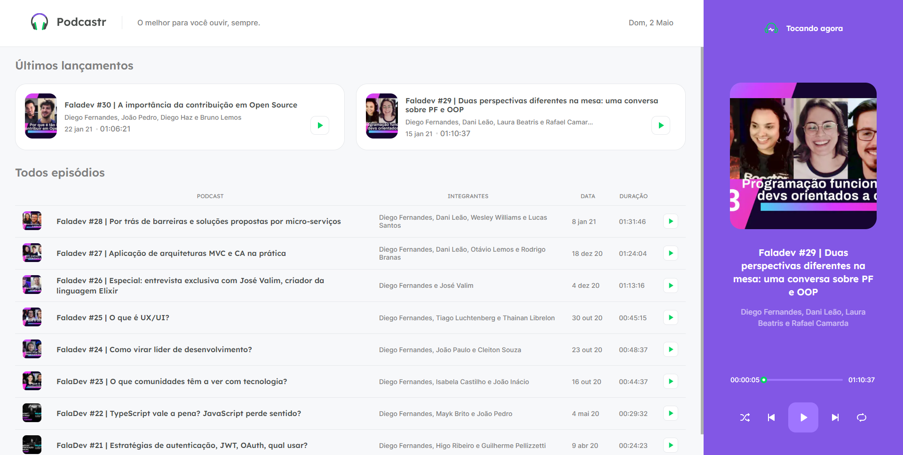
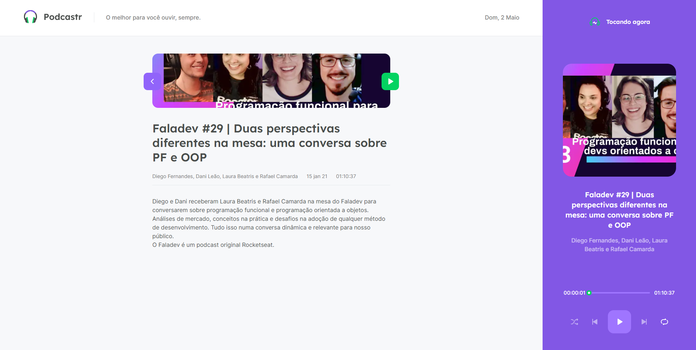
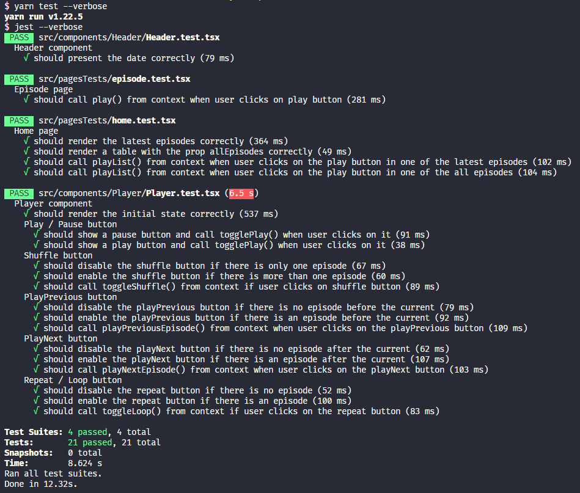
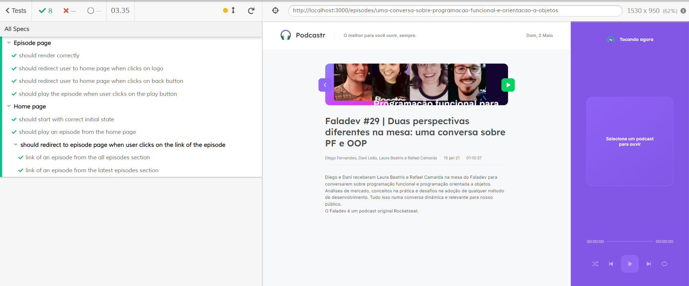

<h1 align="center">
  
</h1>

<h4 align="center">
  A website where people can listen to podcasts about technology, developed with Next.js
</h4>

  
  

  <a href="#technologies">Used Technologies</a>&nbsp;&nbsp;&nbsp;|&nbsp;&nbsp;&nbsp;
  <a href="#objective">Project's goal</a>&nbsp;&nbsp;&nbsp;|&nbsp;&nbsp;&nbsp;
  <a href="#final-result">Final Result</a>&nbsp;&nbsp;&nbsp;|&nbsp;&nbsp;&nbsp;
  <a href="#features">Features</a>&nbsp;&nbsp;&nbsp;|&nbsp;&nbsp;&nbsp;
  <a href="#tests">Tests</a>

<h3 align="center">
  
</h3>

<h2 align="center">
  <a href="https://podcastr-tiago.vercel.app/" target="_blank">
    Demo on Vercel
  </a>
</h2>

<h2 id="techonologies" name="technologies">
  :rocket: Used Technologies
</h2>

- [Next.js](https://nextjs.org/)- Next.js is a framework built on top of React. It was used to build the app in general. 
- [TypeScript](https://www.typescriptlang.org/) - Typescript is a superset of the common JavaScript. With that, we can type and maintain our code easier.
- [Styled Components](https://styled-components.com/) - Styled components is a CSS-in-JS library. It was used to style the whole app.
- [React Testing Library](https://testing-library.com/) - React Testing Library is a library that allows us to create unit and integration tests of React components. It was used to test the components.
- [Cypress](https://www.cypress.io/) - Cypress is a library that allows us to create end to end tests on webpages. It was used to make the end to end tests on the website, this way we can make sure that the site will work correctly in production

<h2 id="objective" name="objective">
  :dart: Project's goal
</h2>

The aim of this project was practicing Next.js with TypeScript, I have been studying these technologies really much lately because I like them. I also took the opportunity to test all the pieces of the app, from the components to the whole pages.

<h2 id="final-result" name="final-result">
  :arrow_forward: Final Result
</h2>

### [You can check the final result clicking here](https://podcastr-tiago.vercel.app/)

### Home page

### Podcast details page

<h2 id="features" name="features">
  :clipboard: Features
</h2>

- All the pages were statically generated, which improves the user experience since the page will not take long to load and be available to use.
- User can:
  - Play podcasts from the home page 
  - Play podcasts from the podcast details page
  - Go to the next episode from a playlist using a button of the player component
  - Go to the previous episode from a playlist using a button of the player component
  - Pause and play the current podcast that is active on the player
  - Turn on a "random" mode for the player, in order to it play a random podcast when the current podcast finishes

<h2 id="tests" name="tests">
  🧪 Tests
</h2>

For this app, I have written unit tests using react-testing-library and jest, and I've also written end to end tests using Cypress, below you can take a look in some details of them.

### Unit tests

### End to end tests

------

Hope you enjoyed this project :smiley: 
:wave: [Get in touch!](https://www.linkedin.com/in/tiagodiass)

### Author: Tiago Dias
